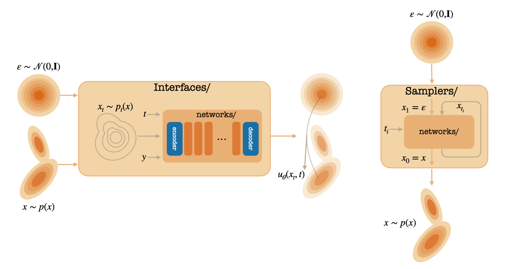

# DiffuseNNX

This repo is a comprehensive JAX/NNX library for diffusion and flow matching generative algorithms, featuring DiT (Diffusion Transformer) and its variants as the primary backbone with support for ImageNet training and various sampling strategies. The whole repo is built with JAX and the very recent Flax NNX (with friendly syntax close to PyTorch). The focus is to provide a lightweight and scalable codebase in JAX & NNX for powering research in generative modeling with diffusion. The repo is still work-in-progress, but decently clean and easy to use. Please fork and/or play with the code! Any feedback is more than welcome!



## Overview

This library provides a unified framework for implementing and training diffusion models and flow matching algorithms using JAX and NNX. It includes implementations of state-of-the-art architectures like DiT (Peebles et al., 2023) and LightningDiT (Yao et al., 2025), with support for multiple diffusion algorithms as SiT (Ma et al., 2024), EDM (Karras et al., 2022), and MeanFlow (Geng et al., 2025). On top of the diffusion backbones, we also support different autoencoder options, including SD-VAE (Rombach et al., 2021) and RAE (Zheng et al., 2025), and also the recent Representation Alignment methods (Yu et al., 2025). We are currently working on adding more features, such as DMD (Yin et al., 2023) and multiple forcing methods (Chen et al., 2024, Huang et al., 2025)!

Despite the recent deprecation, there are some part of the codebase still depending on the Flax `transformers` library. We are currently looking for reproduction / replacement, and if you have good suggestions please let us know!


## Key Features

- **Multiple Architectures** (`networks/`): SD-VAE, ViT, DiT and Lightning DiT implementations with NNX support.
- **Flexible Interfaces** (`interfaces/`): Unified interface APIs supporting SiT, EDM, and MeanFlow. REPA wrapper is also included.
- **Advanced Sampling** (`samplers/`): Unified sampler APIs with support for various sampling methods (deterministic & stochastic) and time schedules.
- **Evaluation Tools** (`eval/`): Support for evaluation metrics for generation (currently only implemented FID).
- **Distributed Training** (`utils/sharding_utils`): Support for TPU training with replicate and FSDP strategies.
- **Visualization** (`utils/visualize.py`): Built-in visualization utilities for training monitoring

## Repo Structure

```
DiffuseNNX/
├── configs/              # Configuration files
├── data/                 # Data loading and preprocessing
├── eval/                 # Evaluation metrics and tools
├── experimental/         # Experimental features
├── interfaces/           # Core diffusion/flow matching interfaces
├── networks/             # Core network architectures
│   ├── encoders/         # Pretrained vision / VAE encoders
│   ├── decoders/         # Trained decoders (only RAE decoder at the moment)
│   ├── transformers/     # Transformer architectures
│   └── unets/           # U-Net architectures
├── samplers/            # Sampling strategies
├── trainers/            # Main training loops
├── utils/               # Utility functions
└── tests/               # Test suite
```

### Core Components

#### 1. Interfaces (`interfaces/`)
The heart of the library, providing unified interfaces for different diffusion/flow matching formulations:

- **`continuous.py`**: Base interface for diffusion / flow-matching algorithms in continuous-time.
- **`repa.py`**: REPA wrapper on top of diffusion interfaces for additional representation alignment.

Detailed documentations included in [interfaces/README.md](interfaces/README.md)

#### 2. Networks (`networks/`)
Modular network architectures:

- **Transformers**: DiT & LightingDiT implementations in both `flax.linen` and NNX; replication in PyTorch also provided.
- **Encoders**: Pretrained vision encoders including RGB, SD-VAE, DINOv2, DINOv2withRegisters.
- **Decoders**: Self-trained ViT-based decoders (specifically for RAE at the moment).
- **UNets**: U-Net architectures used by EDM & EDM2.

Detailed documentations included in [networks/README.md](networks/README.md)

#### 3. Samplers (`samplers/`)
Model-agnostic samplers:

- Deterministic and stochastic samplers (Euler, Heun, Euler-Maruyama)
- Multiple time distribution types (uniform, exponential)

Detailed documentations included in [samplers/README.md](samplers/README.md)


#### 4. Evaluation (`eval/`)
Comprehensive evaluation tools:

- Sampling Loop for generating a bunch of samples from model.
- FID (Fréchet Inception Distance) computation.

Detailed documentations included in [eval/README.md](eval/README.md)

#### 5. Configs (`configs/`)
Configurations for launching experiments. Detailed documentations included in [configs/README.md](configs/README.md)


#### 6. Test suite (`tests/`)
Contains unit tests for all modules implemented in this codebase, including networks, interfaces, samplers, etc. Comprehensive tests comparing NNX and `flax.linen` are also provided in [here](tests/network_tests/nnx/README.md). These tests are pretty clean and self-contained, and you can refer to them to check the detailed usage case for each module in the codebase.

For self-implemented tests, make sure you name the test file in the format of `*_tests.py`, so that the runner file can identify and add it to our test suite.

#### 7. Others
Please check `utils/` and `data/` for all other functionalities! In `docs/` we also provide a lightweight [tutorial](docs/utils/fsdp_in_jax_nnx.ipynb) (cr. [Goerygy](https://github.com/georgysavva)) for implementing & using FSDP with JAX & NNX. Hope you find it helpful!

## Prerequisites

- **Google Cloud Storage access**: Training and evaluation jobs stream checkpoints to a bucket via `--bucket`. Ensure you have access to [Google Cloud Storage Bucket](https://cloud.google.com/storage/docs/creating-buckets) before proceeding. Once that is established, run `gcloud auth application-default login` to generate the credential json file for the gcloud client api used by the codebase.
- **Local Filesystem support**: Alternatively, you can omit the `--bucket` flag to use local filesystem for checkpoint storage. (Thanks @[Wenhao](https://github.com/rese1f) for the support!)
- **Weights & Biases authentication**: The logging helpers require an API key. Visit https://wandb.ai/authorize to copy it, then export it as `WANDB_API_KEY`. `WANDB_ENTITY` is also required to set up the specific WANDB space you want to work in.
- **Secrets & environment loading**: Keep cloud keys out of source control. Store them in an `.env` file and source it in every shell before launching commands.

```bash
# .env (do not commit)
export WANDB_API_KEY="xxxxxxxxxxxxxxxxxxxxxxxxxxxxxxxx"
export WANDB_ENTITY="my-team"
export GOOGLE_APPLICATION_CREDENTIALS="$HOME/.config/gcloud/application_default_credentials.json"
export GCS_BUCKET="my-gcs-bucket"

# load the variables
source .env

# smoke test: ensure the env is wired up
gcloud storage ls gs://$GCS_BUCKET
python - <<'PY'
import os
print("WANDB token loaded:", bool(os.getenv("WANDB_API_KEY")))
print("GCP creds set:", bool(os.getenv("GOOGLE_APPLICATION_CREDENTIALS")))
PY
```


## Installation

This codebase requires `Python<=3.11` to run. We do require both PyTorch and Tensorflow, but only the CPU-only version and should incur minimal overhead.

```bash
# Clone the repository
git clone <repository-url>
cd diffuse_nnx

# Install dependencies
pip install -r requirements.txt

# Install the codebase
pip install -e .
```

**Note**: The codebase is mainly designed for using on Google Cloud TPU machines and haven't been extensively tested on GPUs. To use it on GPU, replace the `jax[tpu]==0.5.1` dependency in `requirements.txt` with `jax[cuda12]==0.5.1`. We greatly appreciate it if you can help validate the performances on GPU!

## Quick Start

Before training, you need to update the `_*_data_presets` entries to where you stored the ImageNet data and corresponding FID statsitics. For a quick and easy guide on extracting the latent dataset & calculating the FID statistics, see [EDM2](https://github.com/NVlabs/edm2).

### Training a DiT Model on ImageNet

```bash
# Basic training command
python main.py \
    --config=configs/dit_imagenet.py \
    --bucket=$GCS_BUCKET \
    --workdir=experiment_name
```

To run different training / evaluation jobs, simply update `--config` will do the trick. We also provide reference training scripts under `commands/`.


## Testing

The library includes comprehensive tests:

```bash
# Run all tests
python tests/runner.py
```

You can also run each individual test via:

```bash
python tests/<path-to-test-file>.py
```

## Performance Benchmarks


### Baseline Reproductions

| Model   | Resolution | Sampler | FID (80 epoch) | FID (final) |
|---------|------------|---------|----------------|-------------|
| SiT-B/2 | 256 |  Heun-32 |     34.49    |      -      | 
| SiT-B/2 + Logitnormal(0, 1) | 256 | Heun-32 | 29.35 | - |
| SiT-XL/2 |  256  |   Heun-32   |    17.62     |  -     |
| REPA-XL/2  |  256 |  Euler-Maruyama-250 |   **9.82*** | - |
| LightningDiT-XL/2 |  256   |  Heun-32  |   7.49 |  -   |
| MF-B/2 (guided)   |  256  |   Euler-1 |    10.24 | 6.61 | 
| MF-XL/2 (guided)  |  256  |  Euler-1  |  5.06   |  3.78 | 
| RAE      |  256   |  Euler-50  |    -         |   **1.65**** |

*We are actively investigating this performance misalignment.

**Only inference code is available for RAE now (`config.standalone_eval=True` is required); we are actively working on the training pipeline.

### NNX vs JAX Native Module Performance

| Module | Exec | Input Size | Device | Duration (s/1k iters) |
|--------|------|------------|--------|----------------------|
| Linear | -    | (4, 1152)  | v6e-8  |  0.03               |
|        | `nnx.jit` |        |        |  0.14             |
|        | `jax.jit` |        |        |  0.02 |
|        | `nnx.pmap` |        |        | 0.51 |
|        | `jax.pmap` |        |        |       0.30           |
| Conv   | -    | (3, 3, 4, 1152)  | v6e-8  | 0.04          |
|        | `nnx.jit` |        |        |  0.20           |
|        | `jax.jit` |        |        | 0.04
|        | `nnx.pmap` |        |        |      0.60            |
|        | `jax.pmap` |        |        |     0.31             |
| MHA   | -    | (16, 72, 1152)  | v6e-8  |  0.04         |
|        | `nnx.jit` |        |        | 0.71             |
|        | `jax.jit` |        |        | 0.03             |
|        | `nnx.pmap` |        |        |    1.37               |
|        | `jax.pmap` |        |        |    0.60              |


## Contributing

### Pipeline

1. Fork the repository
2. Create a feature branch & implement new functionality
3. Add unit tests for new functionality
4. Ensure all tests pass
5. Submit a pull request detailing the descriptions for the new functionality and its usage documentation

### Coding Style & Naming Conventions
Stick to PEP 8 with 4-space indentation, `snake_case` modules/functions, and `CamelCase` classes. Group imports as shown in `trainers/dit_imagenet.py`: stdlib, third-party, then local deps, sorted alphabetically. New modules should include a module docstring plus concise type hints for public APIs. Prefer `absl.logging` for logs and use `ml_collections.ConfigDict` for configuration plumbing.

### Commit & Pull Request Guidelines
Keep commit subject lines short and clean, better under 60 characters. Every PR should describe the experiment intent, mention which config files changed, and note expected metrics or visual outputs. Confirm `python tests/runner.py` (or scoped equivalents) passes and link any associated issue or research note.

### Cloud & Secrets
Keep credentials in environment variables, never in tracked files!

## License

This project is licensed under the terms specified in the LICENSE file.

## Citation

If you use this library in your research, please cite:

```bibtex
@misc{DiffuseNNX,
  author={Nanye Ma},
  title={DiffuseNNX: A JAX/NNX Library for Diffusion and Flow Matching},
  year={2025},
  publisher={Github},
  url={https://github.com/willisma/diffuse_nnx.git}
}
```

## Acknowledgments

- DiT implementation based on Peebles et al. (2023)
- EDM preconditioning from Karras et al. (2022)
- JAX and Flax teams for the excellent framework
- The open-source community for various components and utilities

## Roadmap


### `networks/`

- [x] DiT & LightningDiT definition in NNX
- [x] SD-VAE & RAE encoder / decoder conversion from `flax.linen` to NNX
- [x] Utilities for weight conversions between `torch` and `flax`
- [ ] UNet (EDM & EDM2) implementation in NNX


### `interfaces/`

- [x] Unified interface APIs
- [x] SiT, EDM & MeanFlow implementation
- [ ] sCD & sCT implementation
- [ ] DMD2 implementation

### `samplers/`

- [x] Unified sampler APIs
- [x] Euler, Heun, Euler-Maruyama samplers implementation
- [x] EulerJump sampler (for two-time variable models like MeanFlow)
- [ ] EDM stochastic sampler
- [ ] DPM-solver

### `eval/`

- [x] FID evaluation pipeline
- [ ] IS & other generation evaluation pipelines

### `utils` 

- [x] FSDP implementation
- [x] Wandb logging & visualization support
- [x] Orbax-based distributed checkpointing
- [ ] Tensor parallelism & context parallelism implementation

### `tests`
- [x] Basic unit tests
- [ ] Add Github CI / Coverage support


### Future Work 📋
- [ ] Video generation support
- [ ] Multi-modal / unified generation
